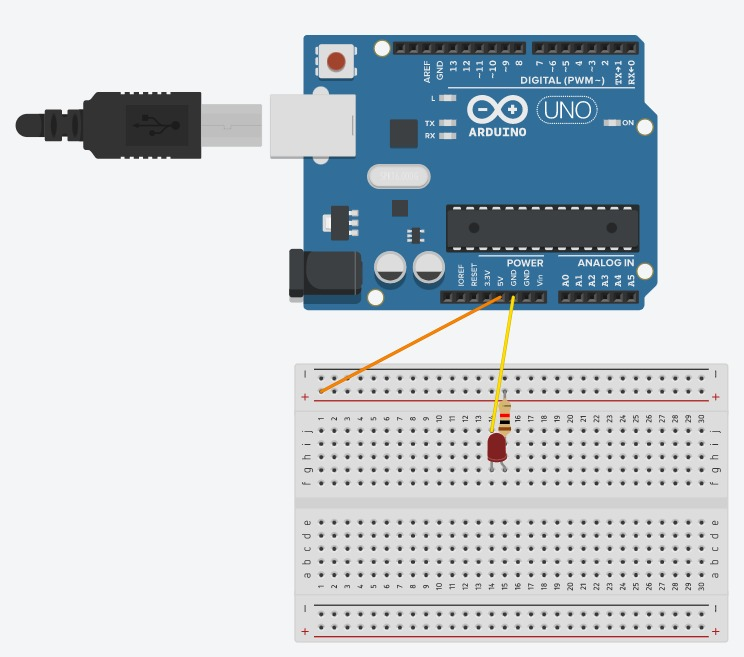
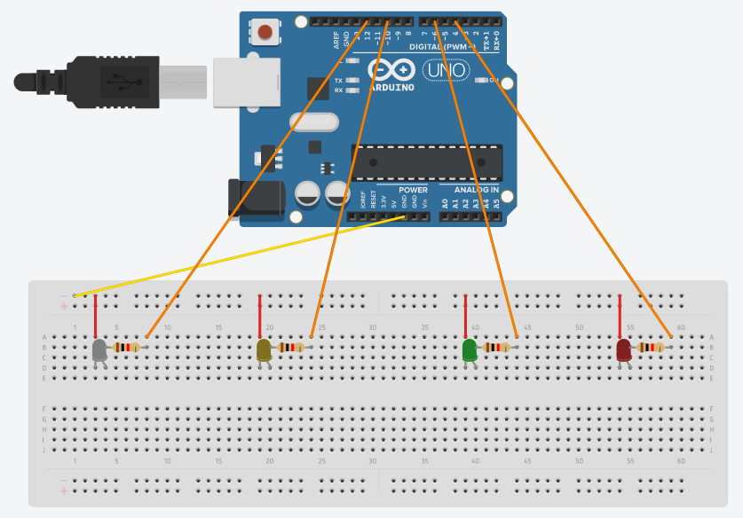

# LED

## Components 
### LED

* Is used as indicator, using a low electricity and lasts really long. Most common one is 5mm LED.
* mm refers to diameter of LED (3mm and 10mm are also common).
* It needs the use of a resistor to not burn out, as it needs to be connected to a voltage source and ground.
* It has an **Anode** (long) which is connected to voltage source trough resistor and a **Cathode** (short) which is connected directly to ground.

### Resistor
* Resist the flow of electricity. The higher the value of the resistor, the more it resists and the less electrical current will flow through it. 
* We can use a resistor to limit how much current flows through the LED and therefore, how brightly it shines.
* The unit of resistance is called the Ohm, which is usually shortened to Ω the Greek letter Omega.
* Resistors do not have a positive and negative lead. They can be connected either way around.

## Diagram

Here´s the following example of a F5 red LED connected to a 5V source using a resistor. Then the cathode of the led is connected to ground.

## Example
Here´s the following example, it contains a semaphore that just turn on in order the LEDs using some delays.

#### Diagram

#### Demo

#### Code

* **pinMode(PIN, OUTPUT);** sets the pin with number *PIN* as an output signal to turn on the LED.
* **digitalWrite(PIN, VALUE);** writes a digital value (HIGH=1 or LOW=0) on the pin with number *PIN*. *HIGH* turns on the pin and *LOW* turns off.

You can find the code [here](./LED.ino).
