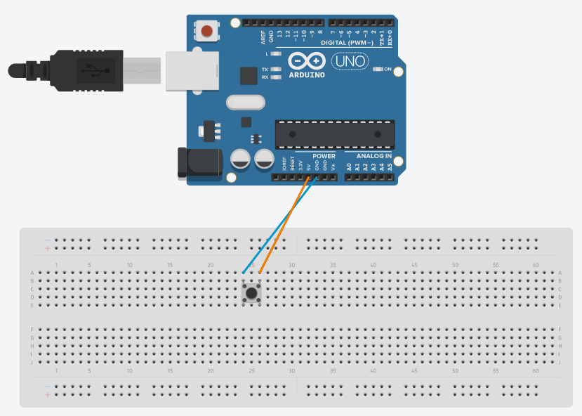
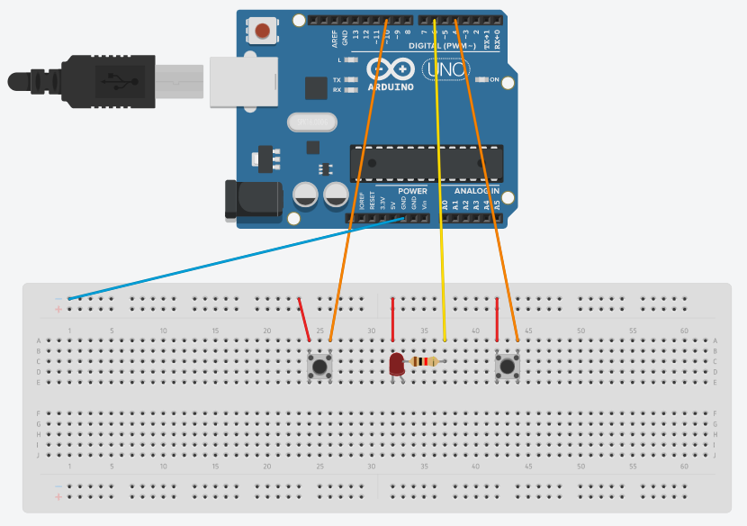

# Button

## Components 
### Button

* They work as a circuit with two parts. Pressing it just connects both parts (LOW=pressed).
* Pins are connected following a straight line, so each part should be receiving the correct flow.

## Diagram

Here´s the following example of a Button connected to a 5V source and ground.

## Example
Here´s the following example, it contains a circuit with a green led that turns on when pressing a button and turns off when pressing the other one (4 and 10 respectively).

#### Diagram

#### Demo

#### Code

* **pinMode(PIN, INPUT_PULLUP);** sets the pin with number *PIN* as an input signal, but if no signal is detected, set default to HIGH.
* **digitalRead(PIN);** reads a digital value (HIGH=1 or LOW=0) on the pin with number *PIN*.

You can find the code [here](./Button.ino).
