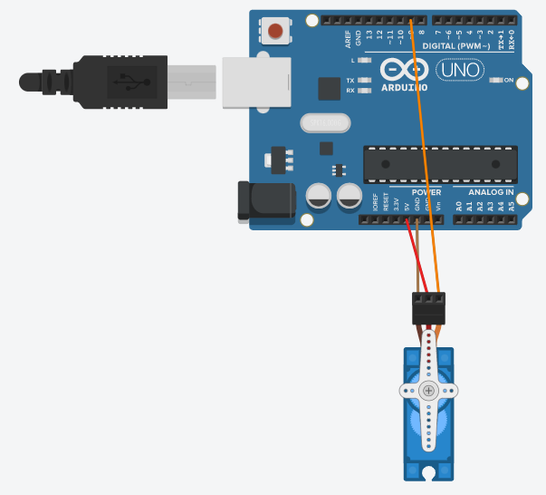

# Servo

## Components 
### Servo
* Servo is a type of geared motor that can only rotate 180 degrees.
* It is controlled by sending electrical pulses and tells to which position move to.
* It has three wires, of which the brown one is the ground wire and should be connected to the GND, the red one is the power wire and should be connected to the 5V, and the orange one is the signal wire and should be connected to the PIN.

## Diagram

Here´s the following example of a Servo connected to a pin, ground and 5V.

## Example
Here´s the following example, it uses the same diagram as above and just moves the motor in several ways.

#### Demo

#### Code

* We use the library **Servo** to take the functions from it.
* **myservo.attach(PIN)** sets the PIN to consider by the Servo.
* **myservo.write(Angle)** sets the angle to where the Servo motor should move to. Minimum is 180 and maximum is 0.

You can find the code [here](./Servo.ino).