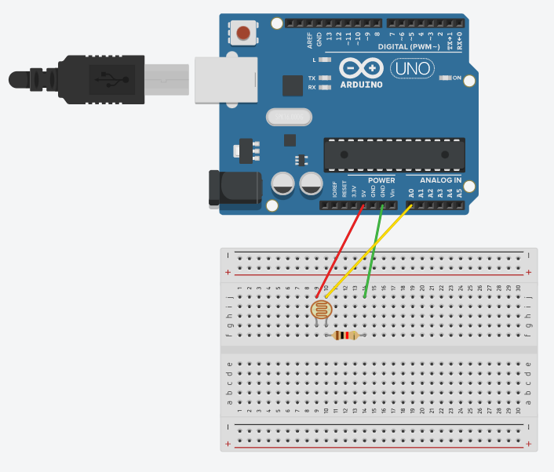

# Photoresistor

## Components 
### Photoresistor

* Photoresistor (or LDR) is a component that works as a resistor but just operates with the quantity of light it receives.
* It has a resistance near to 50kΩ in darkness and Ω500 in brightness.
* It uses a resistor in order to convert the voltage into an analog input.

## Diagram

Here´s the following example of a photoresistor connected to a 5V source and an analog input through a resistor connected to ground too.

## Example
Here´s the following example, it uses the same diagram as above and just captures the amount of light received.

#### Demo

#### Code

* **analogRead(PIN);** gets the analog input from PIN.

You can find the code [here](./Photoresistor.ino).
