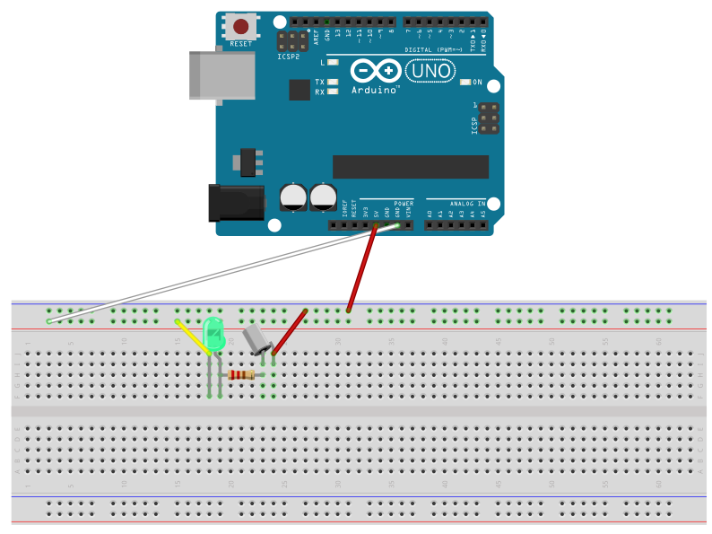
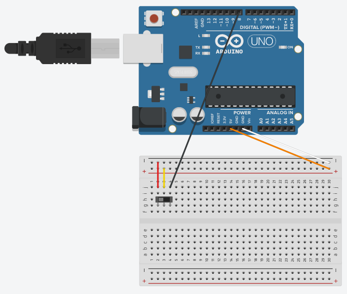
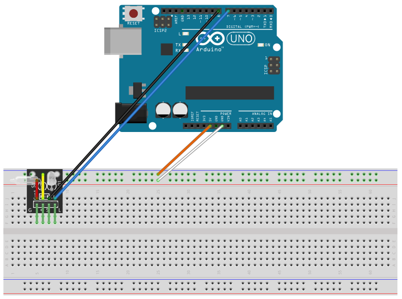

# Tilt Switch (Mercury)

## Components 
### Tilt Switch (Mercury)

* Tilt Switch (Mercury one) contains a drop of mercury with two pins that connects with the drop to make the voltage flow throught it.
* There are several types of tilt switches, but in this post we´ll study the basic mercury one, the KY-017 and KY-027.

**Tilt Switch**

**KY-017**

**KY-027**

## Diagram

Here are several examples of the three different types of tilt switches studied, in order to use them to turn on a LED (a F5 one or built-in one).

**Tilt Switch with F5**

**KY-017**

**KY-027**

## Example
Here are the following examples, it uses the same diagrams as above and just turns the different LEDs.

#### Demo

**Tilt Switch**

**KY-017**

**KY-027**

#### Code

* **pinMode(PIN, OUTPUT);** sets the pin with number *PIN* as an output signal to turn on the LED.
* **digitalWrite(PIN, VALUE);** writes a digital value (HIGH=1 or LOW=0) on the pin with number *PIN*. *HIGH* turns on the pin and *LOW* turns off.
* **digitalRead(PIN);** reads a digital value (HIGH=1 or LOW=0) on the pin with number *PIN*.

You can find the code [here](./Tilt_Switch.ino).
