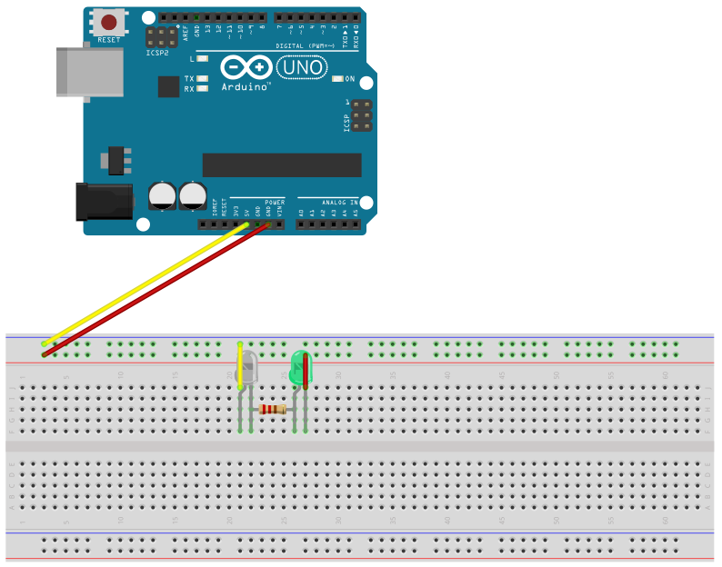

# Flame

## Components 
### Flame

* Flame sensor detects the amount of fire moving in range between 0 and 1024.
* It has an analog input to control the amount of light that it receives.
* There is a more common model named KY-026 that also provides a built-in sensor and two outputs for analog and digital values.

## Diagram

Here´s the following example of a flame sensor that just turns on a LED (either F5 or the built-in in the KY-026).

## Example
Here are the following examples with both models of flame sensors. The code is to turn on the built-in sensor in the UNO board.

#### Demo

#### Code

* **pinMode(PIN, OUTPUT);** sets the pin with number *PIN* as an output signal to turn on the LED.
* **digitalWrite(PIN, VALUE);** writes a digital value (HIGH=1 or LOW=0) on the pin with number *PIN*. *HIGH* turns on the pin and *LOW* turns off.

You can find the code [here](./Flame.ino).
