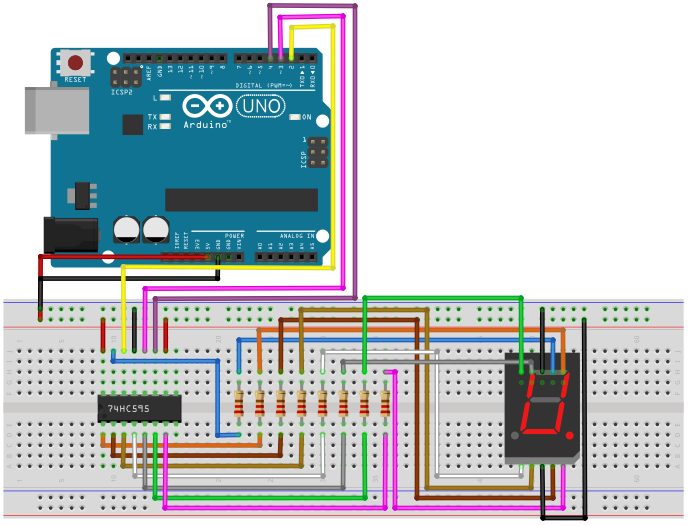

# 7 Segment Display

## Components 
### 7 Segment Display

* 7 Segment Display uses 7 leds in order to represent a digit, making use of 10 pins to configure it.
* Also using a 74HC595 as an offset register allows to ease the setting up of the display.

## Diagram

Here´s the following example of a 7 Segment Display being controlled with a 74HC595 that just displays a number.

## Example

Here´s the following example with a 7 Segment Display and a 74HC595. The code just displays a countdown from 9 to 0 in the display.

#### Demo

#### Code

* **shiftOut(DATAPIN, CLOCKPIN, LSBFIRST, seven_seg_digits[digit]);** sets the bytes to the display to represent a digit.

You can find the code [here](./7_Segment_Display.ino).
