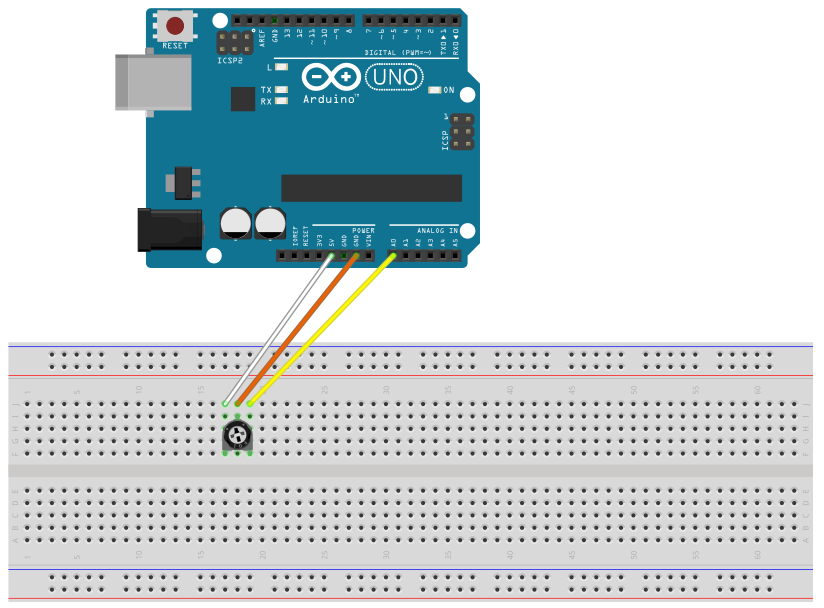

# Potentiometer

## Components 
### Potentiometer

* A potentiometer is a simple mechanical device that provides a varying amount of resistance when its shaft is turned. 
* By passing voltage through a potentiometer and into an analog input on your board, it is possible to measure the amount of resistance produced by a potentiometer (or _pot_ for short) as an analog value.

## Diagram

Here´s the following example of a Potentiometer.

## Example

Here´s the following example with a Potentiometer. The code just prints the voltage on the serial monitor.

#### Demo

#### Code

* **analogRead(PIN);** reads an analog input from the analog PIN.

You can find the code [here](./Potentiometer.ino).
