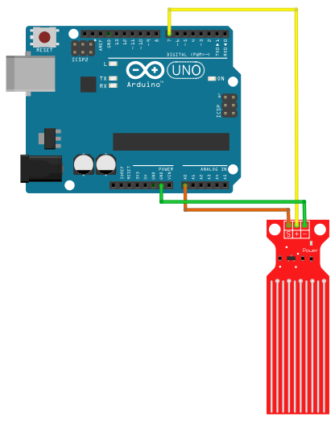

# Water Level

## Components 
### Water Level

* A Water Level sensor is used to detect the amount of water found and depth of it.
* The power and sense traces form a variable resistor (much like a potentiometer) whose resistance varies based on how much they are exposed to water.
* One well-known issue with these sensors is that they have a shorter lifespan because they are constantly exposed to moisture. Moreover, constantly applying power to the sensor while immersed in water significantly accelerates the rate of corrosion.
* To avoid this, it is recommended that the sensor be turned on only when taking readings.

## Diagram

Here´s the following example of a Water Level sensor.

## Example

Here´s the following example with a Water Level sensor. The code just prints the level on the serial monitor.

#### Demo

#### Code

* **analogRead(PIN);** reads an analog input from the analog PIN.

You can find the code [here](./Water_Level.ino).
