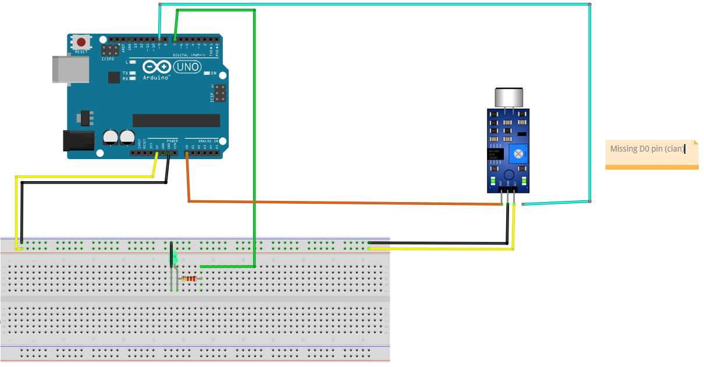

# Sound

## Components 
### Sound

* The microphone sound sensor, as the name says, detects sound. It gives a measurement of how loud a sound is.
* It has two outputs that contains whether a sound is produced (digital) and the loud it is (analog).
* There are several models, but in this post only the KY-037 and KY-038 has been used.

## Diagram

Here´s the following example of a Sound sensor.

## Example

Here´s the following example with a Sound sensor. It receives a sound with a digital input and just turns on/off the LED.

#### Demo

#### Code

* **pinMode(PIN, INPUT_PULLUP);** sets the pin with number *PIN* as an input signal, but if no signal is detected, set default to HIGH.
* **digitalRead(PIN);** reads a digital value (HIGH=1 or LOW=0) on the pin with number *PIN*.

You can find the codes [here](./Sound.ino).
