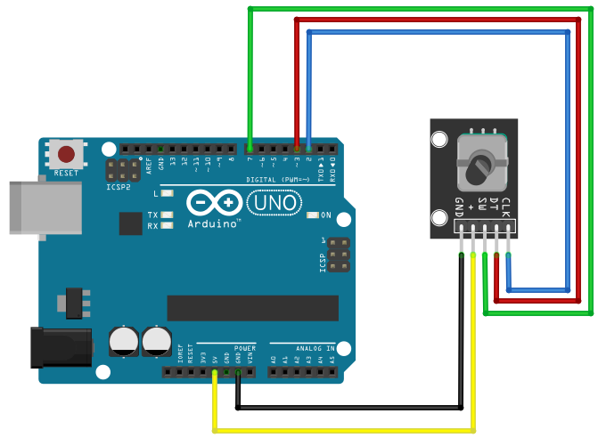

# Rotary Encoder

## Components 
### Rotary Encoder

* The Rotary Encoder (or KY-040 Module) is an incremental encoder with two outputs slightly out of phase, then we could know in which direction we are turning the shaft.
* There are three main pins: SW for push button, DT for output A, CLK for output B.
* It needs an interruption in order to avoid mechanical issues and wrong detections, also adding a small interval between interruptions would avoid rebounds.

## Diagram

Here´s the following example of a Rotary Encoder.

## Example

Here´s the following example with a Rotary Encoder. It moves a position from 0 by moving to left or right, substracting or adding. Then if the push button is pressed, it is reset to 0.

#### Demo

#### Code

* **attachInterrupt(digitalPinToInterrupt(PINCLK), encoder, LOW);** stops the current execution of code when the PINCLK reachs a state LOW, then executes the function *encoder* and finally returns to the loop.

You can find the codes [here](./Rotary_Encoder.ino).
