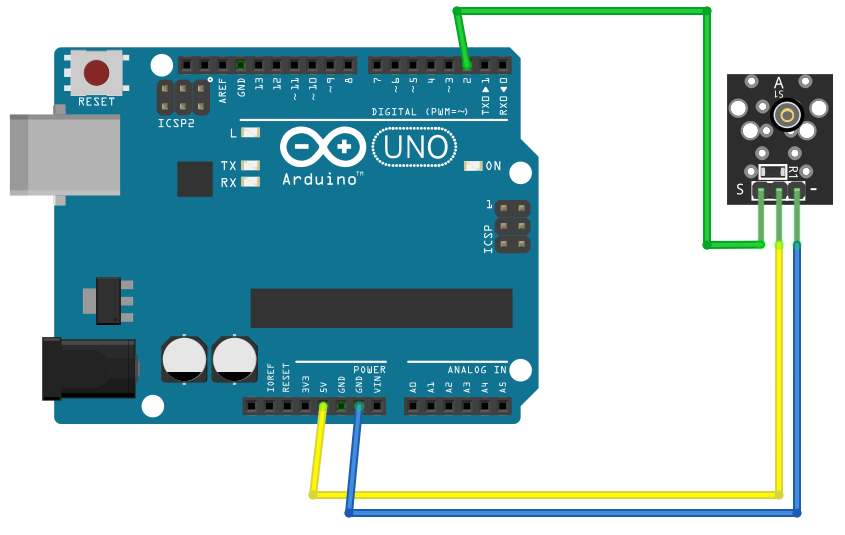

# Shock

## Components 
### Shock

* Shock sensor enables shock and vibration detection.
* The vibration detector module KY-002 (Shock) consists of a spring and a central conductive pole with a 10K resistor connected to the positive power supply. The spring reacts to shocks and vibrations by moving away from its center and closing the circuit to ground. Therefore, the output is inverse: a HIGH level means that there is no detection, and a LOW level means that there is shock or vibration.

## Diagram

Here´s the following example of a Shock sensor.

## Example

Here´s the following example with a Shock (vibration sensor). It just turns on the built-in LED when it detects a vibration.

#### Demo

#### Code
* Shock sensor is always **HIGH** when no vibration is detected. So status **LOW** means a vibration is detected.

You can find the code [here](./Shock.ino).
