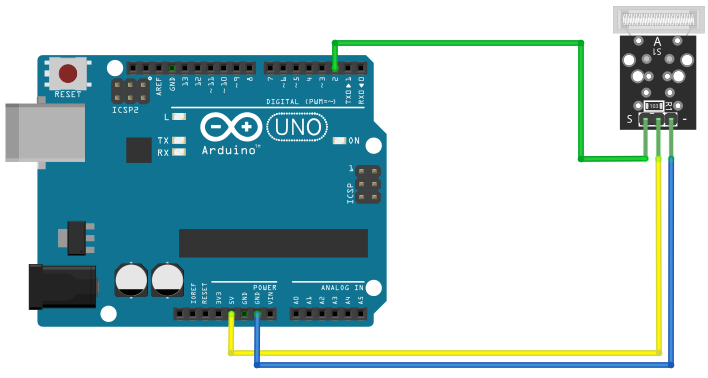

# Knock

## Components 
### Knock

* The Knock Sensor (KY-031) module is a vibration sensor that sends a signal when a knock/tap is detected.
* This module consists of a spring-based sensor, a 10 kΩ resistor and 3 male header pins. The spring emits a high signal when a vibration is detected.

## Diagram

Here´s the following example of a Knock sensor.

## Example

Here´s the following example with a Knock (tap sensor). It just turns on the built-in LED when it detects a tap.

#### Demo

#### Code

You can find the code [here](./Knock.ino).
