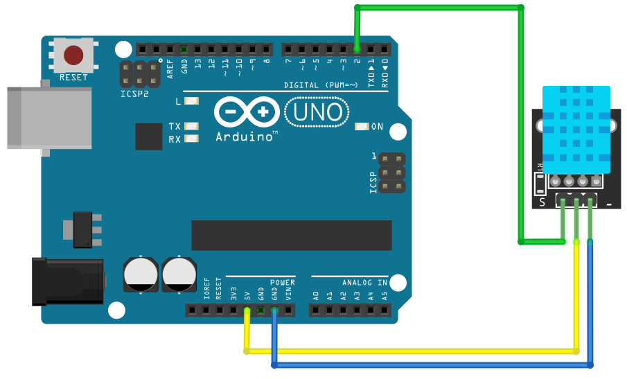

# Temperature and Humidity

## Components 
### Temperature and Humidity

* The Temperature and Humidity sensor (DHT11) allows us to measure the ambient humidity and temperature.
* One of the advantages of the DHT11, in addition to measuring temperature and humidity, is that it is digital. Unlike sensors such as the LM35, this sensor uses a digital pin to send us the information and therefore, we will be more protected against noise.

## Diagram

Here´s the following example of a Temperature and Humidity sensor.

## Example

Here´s the following example with a Temperature and Humidity sensor. It just prints the humidity, temperature in Celsius and in Fahrenheit on the serial monitor.

#### Demo

#### Code

You can find the code [here](./Temperature_and_Humidity.ino).
