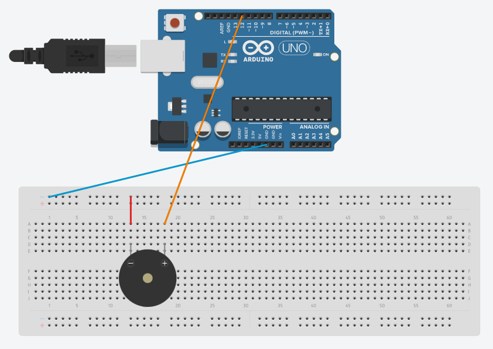

# Active Buzzer

## Components 
### Active Buzzer

* Is a component that emits a sound when a voltage source is given.
* As it´s active (sealed with a sticker), it just needs to set the pin and output mode, the frequency is standard.
* To set the frequency, it needs to be set a certain amount of iterations of turning on/off and the quantity of them determines the duration of it.

## Diagram

Here´s the following example of a Active Buzzer connected to a pin and ground.

## Example
Here´s the following example, it uses the same diagram as above and reproduces two different frequencies, using 1 second and 1ms between to produce different sounds.

#### Demo
Since markdown does not support videos, and here we try to see how it beeps, the video is linked [here](./video/Active_Buzzer_demo.mp4).

#### Code

* **pinMode(PIN, OUTPUT);** sets the pin with number *PIN* as an output signal.
* **digitalWrite(PIN);** writes a digital value (HIGH=1 or LOW=0) on the pin with number *PIN*.
* for loop determines the number of iterations (duration is delays in there multiplied by the number of iterations) and the delay between turning on/off determines the frequency of beep.

You can find the code [here](./Active_Buzzer.ino).

## Cool feature

As you would expect, you can try to recreate some songs (or create your own one) using different frequencies and durations. A funny example I´ve found researching is the one given in [Hibit-dev Buzzer repository](https://github.com/hibit-dev/buzzer). It contains the library and examples of some really known songs.

I´ve tried the Mario´s song, you can see [here](./video/Active_Buzzer_mario.mp4).