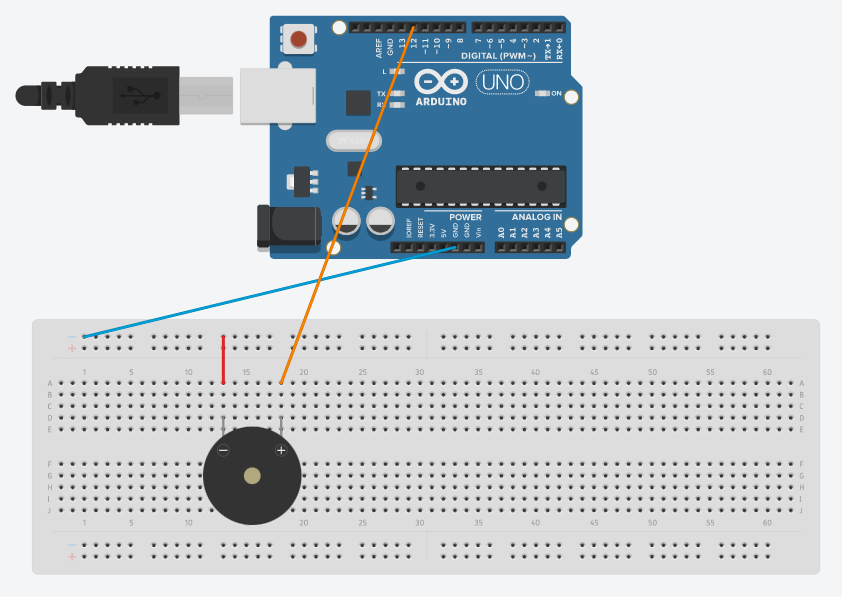

# Passive Buzzer

## Components 
### Passive Buzzer

* Passive buzzer is based on using PWM generating audio to make the air to vibrate. Appropriately changed as long as the vibration frequency, it can generate different sounds.
* We should be careful not to use the *analogWrite()* function to generate a pulse to the buzzer, because the pulse output is fixed (**500Hz**)

## Diagram

Here´s the following example of a Passive Buzzer connected to a pin and ground.

## Example
Here´s the following example, it uses the same diagram as above and reproduces the main musical notes.

#### Demo
Since markdown does not support videos, and here we try to see how it beeps, the video is linked [here](./video/Passive_Buzzer_demo.mp4).

#### Code

* We use the library **pitches** to take the functions from it and notes already defined.
* We define the melodies and duration.
* We use the function **tone** to indicate the pin to use, melody and duration of the note.

You can find the code [here](./Passive_Buzzer.ino).

## Cool feature

As you would expect, you can try to recreate some songs (or create your own one) using different frequencies and durations. A funny example I´ve found researching is the one given in [Hibit-dev Buzzer repository](https://github.com/hibit-dev/buzzer). It contains the library and examples of some really known songs.

I´ve tried the Mario´s song, you can see [here](./video/Passive_Buzzer_mario.mp4).