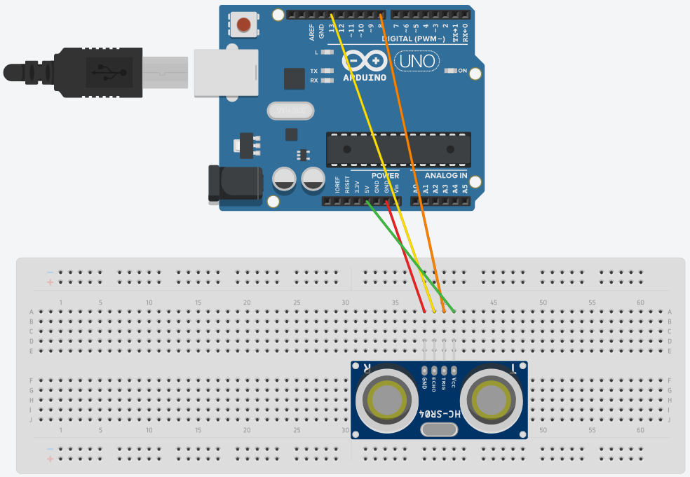
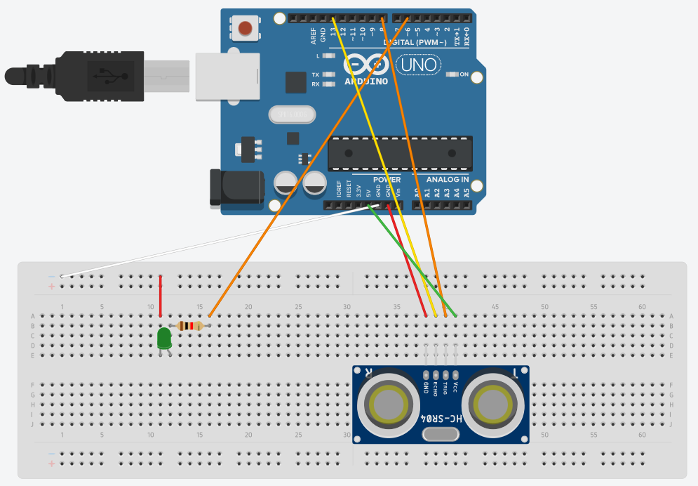

# Ultrasonic SR04

## Components 
### Ultrasonic SR04
* Ultrasonic SR04 sensor provides a non-contact measurement function. Module includes ultrasonic transmitters, receiver and control circuit.
* Principle of work:
	* Uses IO trigger for at least 10us high level signal.
	* Modules sends 40kHz and detect whether is a pulse signal back.
	* If signal back, detects time and computes distance.
* Test distance =  (high level time × velocity of sound (340m/s) / 2

## Diagram

Here´s the following example of a Ultrasonic SR04 connected to a echo pin, trigger pin, ground and 5V.

## Example
Here´s the following example, it uses an Ultrasonic SR04 sensor to detect distance, and if the distance is below 10cm, it turns a green led on. If not, it turns the led off.

#### Demo

#### Code

* We use the library **SR04** to take the functions from it.
* **Serial.begin(9600);** sets the Serial port for the monitor to show distance in console.
* **sr04.Distance();** gets the distance from the sensor.
* **Serial.print(a);** prints on the serial monitor.

You can find the code [here](./Ultrasonic_SR04.ino).