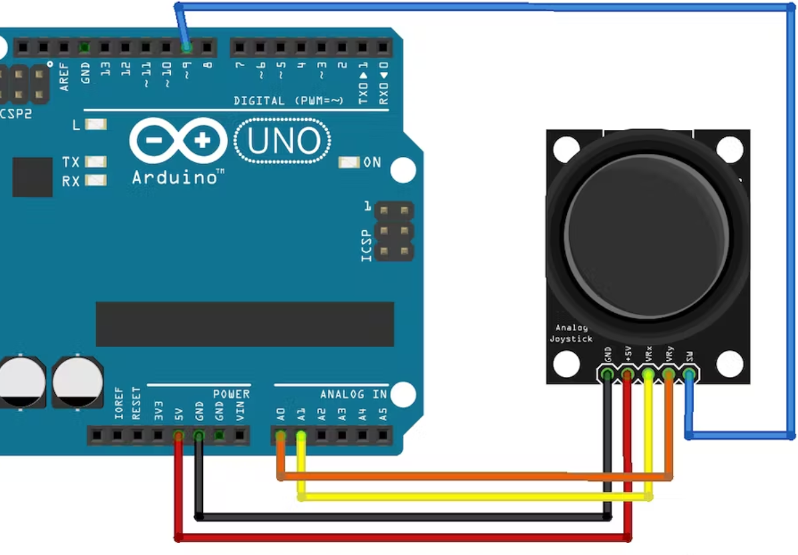

# Analog Joystick

## Components 
### Analog Joystick
* Analog Joystic module is used to control movements as in a console game.
* Module has 5 pins: VCC, GND, X, Y, SW.
* X and Y are controlled by analog pins.

## Diagram

Here´s the following example of a Analog Joystick connected to 5 pins, 2 of them analog.

## Example
Here´s the following example, it uses the same diagram as above and just prints on serial monitor the moves done on axis.

#### Demo

#### Code

* **digitalWrite(SW_pin, HIGH);** sets the joystick as active to use it.
* ****
* **analogRead(PIN)** reads an analog value from the corresponding axis of the joystick.

You can find the code [here](./Analog_Joystick.ino).