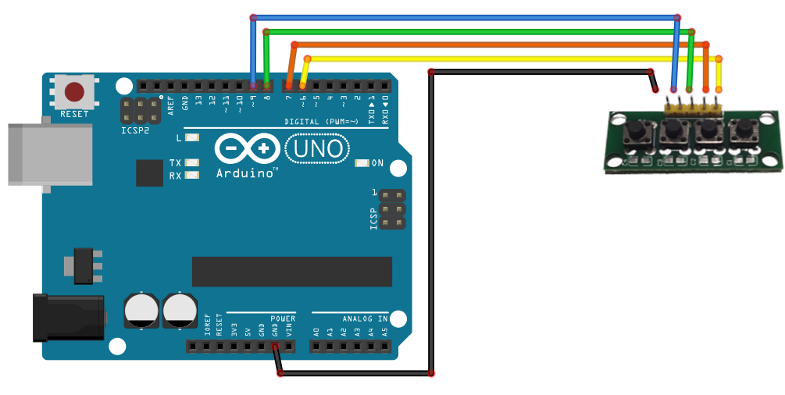

# 4x1 Buttons

## Components 
### 4x1 Buttons

* This module eases the connection to 4 push buttons into just one module.
* It has a PIN to GND and 4 PINs to control each of the push buttons.

## Diagram

Here´s the following example of a 4x1 Buttons.

## Example

Here´s the following example with a 4x1 Buttons. It blinks the builtin LED x times depending on the button pressed.

#### Demo

#### Code

You can find the code [here](./4x1_Buttons.ino).
