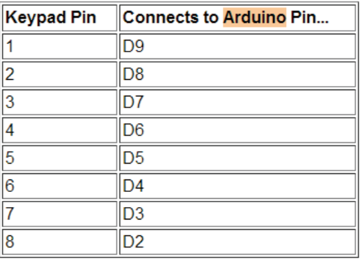
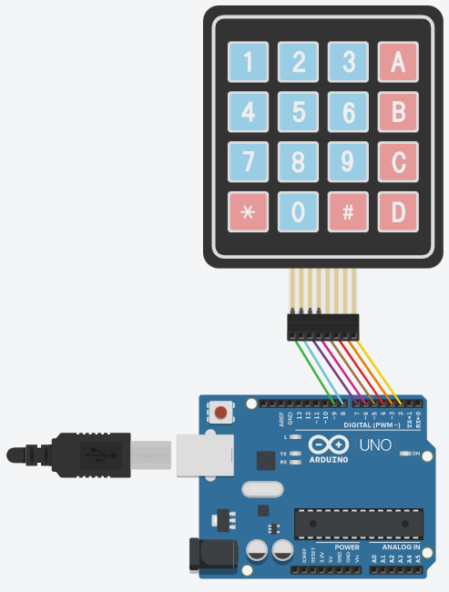

# Membrane Switch Module

## Components 
### Membrane Switch Module
* Membrane Switch Module provides a keypad to input numbers or other values as in a mobile phone, calculator or other devices.
* Membrane module are connected into 8 pins to control the keypad.

## Diagram

Here´s the following example of a Membrane Switch Module connected to 8 pins.

## Example
Here´s the following example, it uses the same diagram as above and just prints on serial monitor the keys pressed.

#### Demo

#### Code

* We use the library **Keypad** to take the functions from it.
* **Keypad customKeypad = Keypad( makeKeymap(hexaKeys), rowPins, colPins, ROWS, COLS);** sets the keypad controller to set pins and matrix of values.
* **customKeypad.getKey();** gets the value pressed on the keypad.

You can find the code [here](./Membrane_Switch_Module.ino).