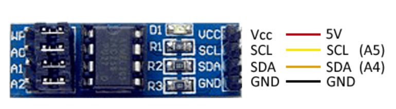

# EEPROM AT24C256

## Components 
### EEPROM AT24C256

* The AT24C256 is an integrated board that incorporates an EEPROM (Electrically Erasable and Programmable Read Only Memory) that can be accessed via the I2C bus.
* This external EEPROM can be connected to processors such as the Arduino to store variables that persist between resets or when power is lost.
* The AT24C256 EEPROM has 256 Kb, organised in 32,768 single-byte cells. Up to 4 devices can be connected on the same I2C bus for a total of 1 Mbit (128 KBytes).

All information has been taken from [Luis Llamas](https://www.luisllamas.es/arduino-eeprom-externa-i2c-at24c256/) website.

## Diagram

Here´s the following example of a EEPROM AT24C256.

#### Code

You can find the code from [here](./Infrarred_Temperature.ino).
