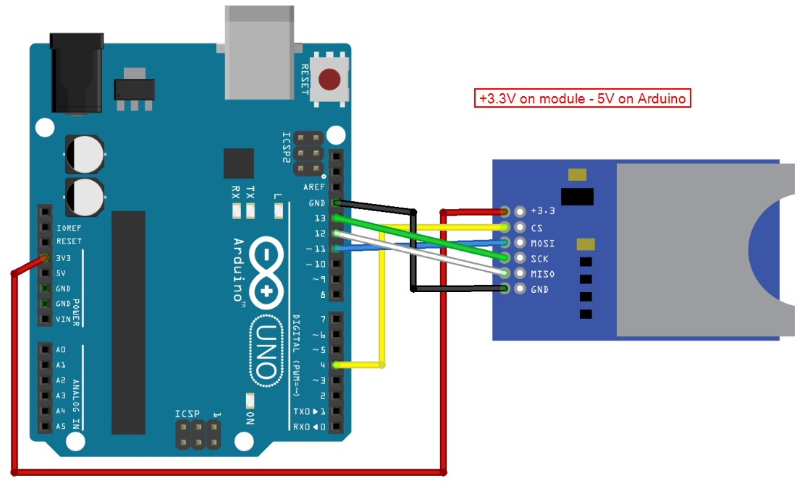

# SD Card

## Components 
### SD Card

* The SD card module is specially useful for projects that require data logging.
* The Arduino can create a file in an SD card to write and save data using the SD  library.
* There are different models from different suppliers, but they all work in a similar way, using the SPI communication protocol. The module used in this tutorial is the one shown in figure below (front and back view).

## Diagram

Here´s the following example of a SD Card module.

## Example

Here´s the following example with a SD Card module. It reads the content of a file in the SD Card.

#### Demo

#### Code

You can find the code to write [here](./SD_Card_write.ino) and to read [here](./SD_Card_read.ino).
