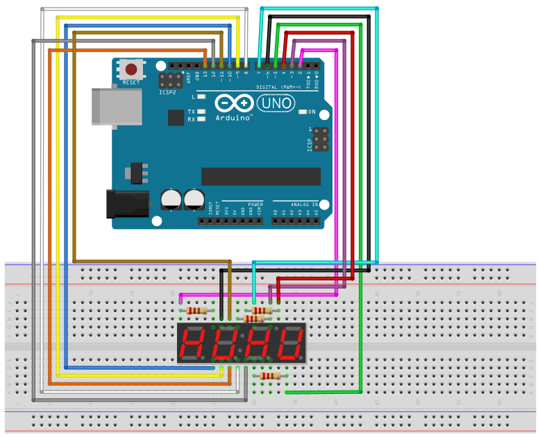
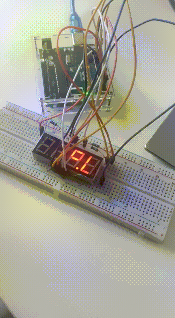

# 7 Segments 4 Digits Display

## Components 
### 7 Segments 4 Digits Display

* 7 Segments 4 Digits Display uses 7 leds in order to represent a digit, and represents 4 digits.
* It uses a constant refresh method in order to print constantly all digits by refreshing all of them so quick that human eye doesn´t even notice it.
* It´s controlled by 4 digital pins to display all 4 digits and 7 segment pins to control the digit to display.

## Diagram

Here´s the following example of a 7 Segment 4 Digits Display.

## Example

Here´s the following example with a 7 Segment 4 Digits Display. The code just acts like a chronometer printing the time accumulated.

#### Demo

#### Code

* **setNumber(NUMBER, DECIMAL);** sets the number and decimal position to represent on the display.
* **refreshDisplay();** refreshes the display, needs to be constantly executed to represent the number.
* **setBrightness(BRIGHTNESS)** sets the brightness of the display.

You can find the code [here](./7_Segment_4_Digits_Display.ino).
