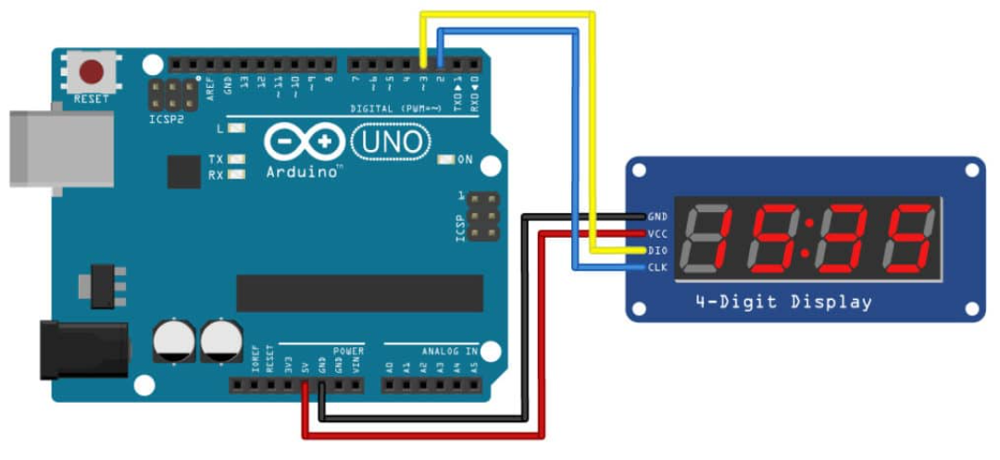

# 7 Segment 4 Digits TM1637 Display

## Components 
### 7 Segment 4 Digits TM1637 Display

* 4-digit 7-segment displays typically require 12 connection pins. That is quite a lot and does not leave much room for other sensors or modules. Thanks to the TM1637 IC mounted on the back of the display module, this number can be reduced to just four. Two pins are needed for the power connections and the other two pins are used to control the segments.
* The 7-segment displays contain 7 (or 8) individually addressable LEDs. The segments are labelled A to G and some displays also have a dot (the 8th LED).

## Diagram

Here´s the following example of a 7 Segment 4 Digits TM1637 display.

## Example

Here´s the following example with a 7 Segment 4 Digits TM1637 display. It displays several numbers, a word, an hour, a temperature and turns on and off.

#### Demo

#### Code

You can find the code [here](./7_Segment_4_Digits_TM1637_Display.ino).
