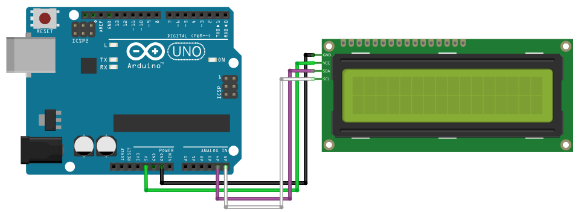

# I2C LCD Display

## Components 
### I2C LCD Display

* Normally when working with a LCD Display, you´ll find out you need a lot of wires to connect it. A great solution to this problem involves the use of an LCD which is controlled over the I2C bus - which means there are far-fewer wires to connect.
* I2C is short for Inter-IC. And it is a type of BUS. This is designed by Philips semiconductors. I2C is a synchronous, multi slave, multi master packet switched, single-ended serial bus. ie. multiple chips can be connect to the same bus.I2C uses only two bidirectional open collector or open drain lines, Serial Data Line (SDA) and Serial Clock Line (SCL), pulled up with resistors. Typical voltages used are +5 V or +3.3 V, although systems with other voltages are permitted.

## Diagram

Here´s the following example of a I2C LCD Display.

## Example

Here´s the following example with a I2C LCD Display. It configures a LCD Display, prints two scrolling messages on different lines.

#### Demo

#### Code

You can find the code [here](./I2C_LCD_Display.ino).
