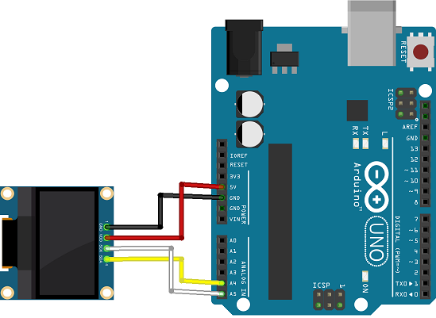
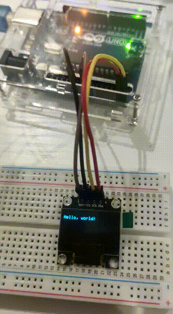

# I2C OLED Display

## Components 
### I2C OLED Display

* The organic light-emitting diode (OLED) is the SSD1306 model: a monocolor, 0.96-inch display with 128×64 pixels.
* The OLED display doesn’t require backlight, which results in a very nice contrast in dark environments. Additionally, its pixels consume energy only when they are on, so the OLED display consumes less power when compared with other displays.
* This specific model comunnicates with the Arduino board using the I2C protocol.

## Diagram

Here´s the following example of a I2C OLED Display.

## Examples

### Write

Here´s the following example with a I2C LCD Display writing on it. It prints two messages in the screen to salute.

#### Demo

#### Code

You can find the code [here](./I2C_OLED_Display_Write.ino).

### Scroll

Here´s the following example with a I2C LCD Display scrolling a message on it. It scrolls a message horizontally in the screen and goes back.

#### Demo

#### Code

You can find the code [here](./I2C_OLED_Display_Scroll.ino).

### Font

Here´s the following example with a I2C LCD Display changing fonts. It prints two different messages changing the font.

#### Demo

#### Code

You can find the code [here](./I2C_OLED_Display_Font.ino).

### Draw

Here´s the following example with a I2C LCD Display drawing figures on it. It draws several forms on the display, using different figures and inverting one of them.

#### Demo

#### Code

You can find the code [here](./I2C_OLED_Display_Draw.ino).

### Image

Here´s the following example with a I2C LCD Display displaying an image on it. It uses a bitmap in C code to display an image.

Here´s also a tutorial on [how to convert an image to bitmap in C](https://docs.splitkb.com/hc/en-us/articles/360013811280-How-do-I-convert-an-image-for-use-on-an-OLED-display-).

#### Demo

#### Code

You can find the code [here](./I2C_OLED_Display_Image.ino).
