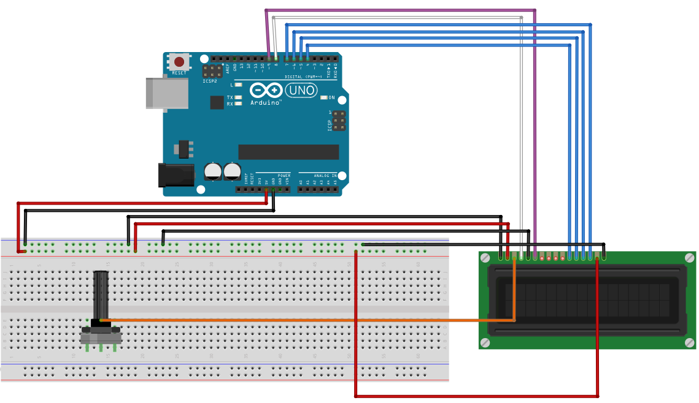

# LCD Display

## Components 
### LCD Display

* A liquid crystal display or LCD (liquid-crystal display) is a thin, flat screen consisting of a number of color or monochrome pixels placed in front of a light source or reflector. It is often used in battery-powered electronic devices because it uses very small amounts of electrical power.

## Diagram

Here´s the following example of a LCD Display.

## Example

Here are the following examples with a LCD Display. First one just prints a message and updates the time. The second one scrolls a message on the display.

#### Demo

#### Code

* **LiquidCrystal lcd(rs, en, d4, d5, d6, d7);** sets the pins where to read from for the LCD display.
* **lcd.begin(16, 2);** initializes the LCD display with number of columns and rows.
* **lcd.print(MESSAGE);** prints a message on the LCD display.
* **lcd.setCursor(COL, ROW);** sets the cursor to write from that position.
* **lcd.scrollDisplayLeft();** indicates the LCD display to scroll a position to the left.

You can find the codes [here](./src).
