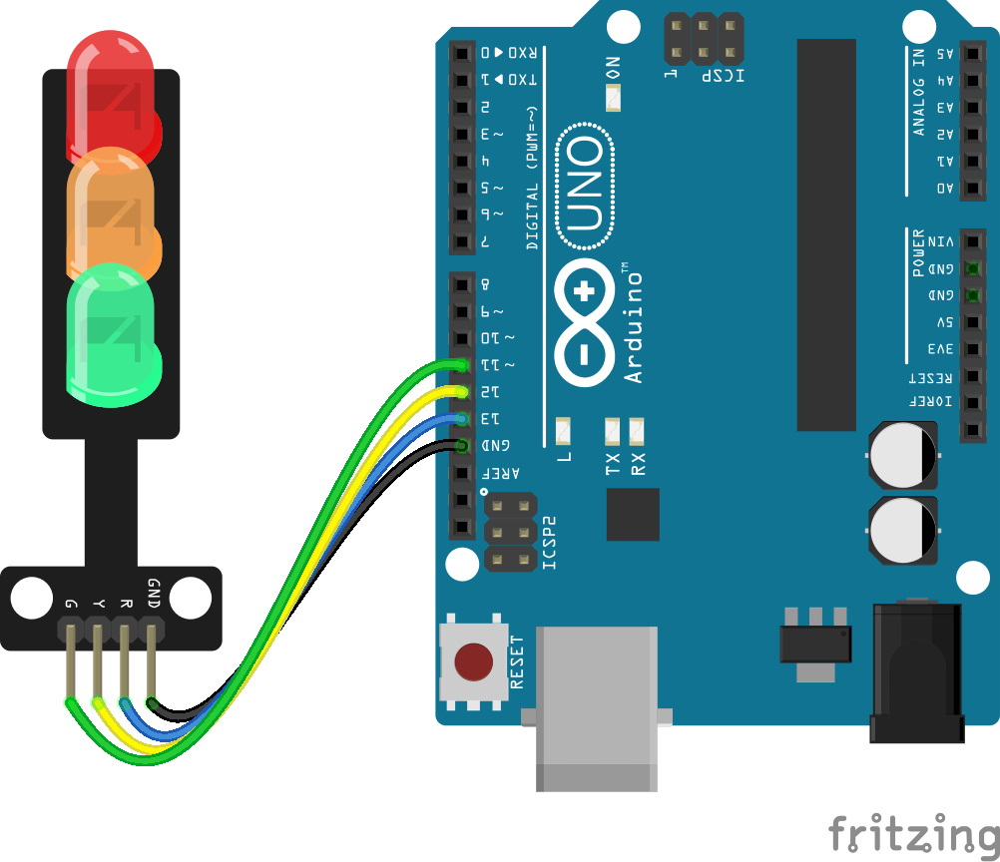

# Led Traffic Light

## Components 
### Led Traffic Light

* This is a mini-traffic light display module, high brightness, very suitable for the production of traffic light system model. It is featured with its small size, simple wiring, targeted, and custom installation. It can be connected PWM to control the brightness of the LED.

## Diagram

Here´s the following example of a LED Traffic Light display.

## Example

Here´s the following example with a LED Traffic Light display. It just turns on/off the three colors.

#### Demo

#### Code

You can find the code [here](./LED_Traffic_Light.ino).
