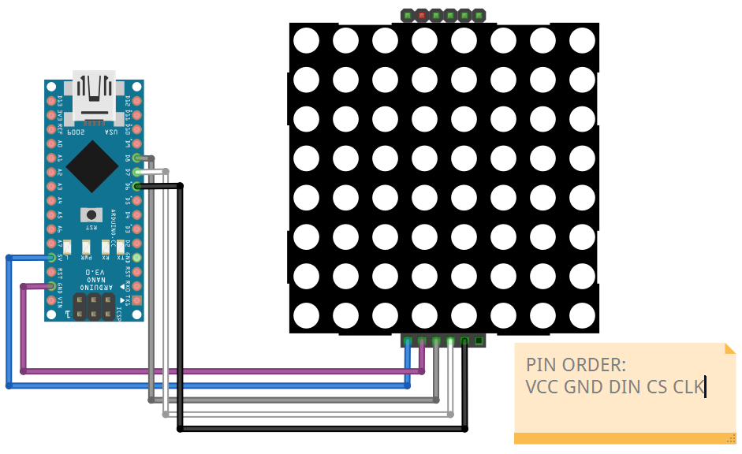
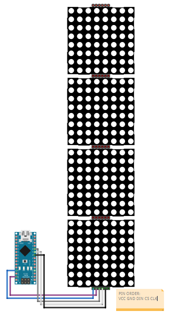

# Matrix

## Components 
### Matrix

* LED displays are often packaged as matrixes of LEDs arranged in rows of common anodes and columns of common cathodes, or the reverse.
* To control an individual LED, you set its column LOW and its row HIGH. To control multiple LEDs in a row, you set the row HIGH, then take the column high, then set the columns LOW or HIGH as appropriate; a LOW column will turn the corresponding LED ON, and a HIGH column will turn it off.
* Some integrated modules also proposes an easier solution by providing the MAX7219 controller together, or also joining several matrixes together.

## Diagram

Here´s the following example of a Matrix display.

Here´s the following example of a 4 Matrix display.

## Example

Here´s the following example with a Matrix display and later with a 4 Matrix display. It just displays my username, either showing letter by letter or scrolling.

#### Demo

#### Code

You can find the code for Matrix example [here](./Matrix.ino) and the code for 4 Matrix example [here](./Matrix_4.ino).
