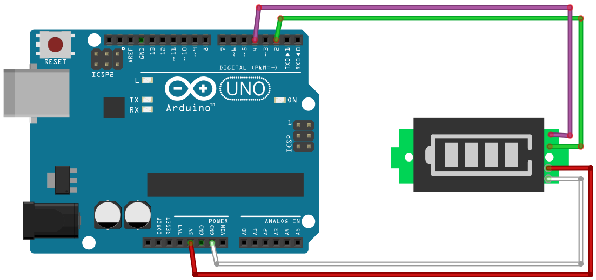

# Mini Battery Display

## Components 
### Mini Battery Display

* Its a mini display that just represents the charge of a battery.
* It has several LEDs of different colors depending on the charge.

## Diagram

Here´s the following example of a Mini Battery Display.

## Example

Here´s the following example with a Mini Battery Display. It turns on the different lights of the battery display like its charging.

#### Demo

#### Code

You can find the code [here](./Mini_Battery_Display.ino).
