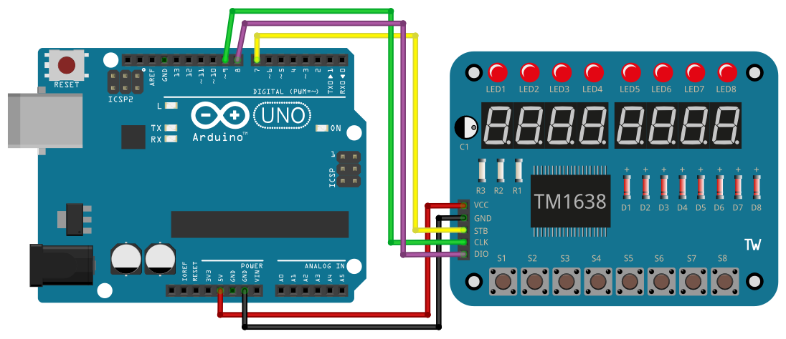

# TM1638

## Components 
### TM1638

* TM1638 board contains eight 7-segment red LED digits, eight red/green LEDs and also eight buttons for user input.
* The board is controlled by a TM1638 IC.

## Diagram

Here´s the following example of a TM1638.

## Example

Here´s the following example with a TM1638. It prints some numbers on the 7-digit display, then a word turning on LEDs in order, and a message indicating to press
  buttons to turn on LEDs.

#### Demo

#### Code

You can find the code [here](./TM1638.ino).
