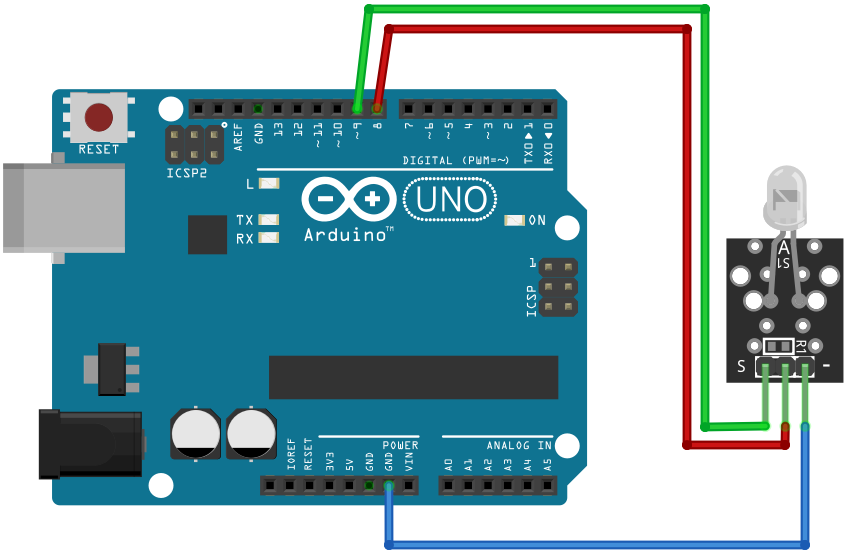

# 2 Color LED

## Components 
### 2 Color LED

* The KY-011 and KY-029 Two Color LED module emits red and green light. You can adjust the intensity of each color using PWM.

## Diagram

Here´s the following example of a 2 Color LED.

## Example

Here´s the following example with a 2 Color LED (with KY-011 and KY-029). It just alternates between red and green colors in LED.

#### Demo

#### Code

You can find the code [here](./2_Color_LED.ino).
