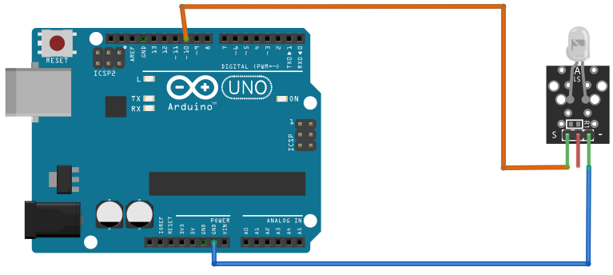

# 7 Color Flash LED

## Components 
### 7 Color Flash LED

* This module specially designed for arduino will allow you to generate a very intense and 7 colors light in a quick and easy way.
* This color changing module is composed of a high brightness light emitting led and a surface limiting resistor to protect the led. 

## Diagram

Here´s the following example of a 7 Color Flash LED.

## Example

Here´s the following example with a 7 Color Flash LED. It just turns it on/off.

#### Demo

#### Code

You can find the code [here](./7_Color_Flash_LED.ino).
