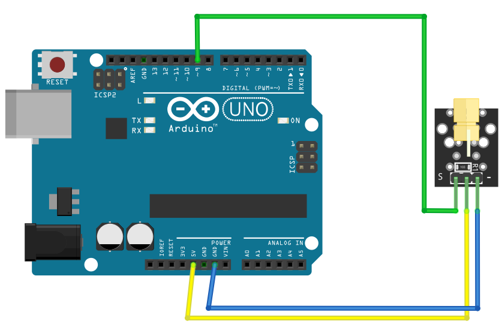

# Laser Emit

## Components 
### Laser Emit

* A laser diode is a device similar to a conventional LED, but instead of emitting conventional light it emits a laser beam.
* As we know, unlike a conventional light beam, a laser beam travels in a straight line. If the laser generator were perfect and the beam were in a vacuum, the light would follow its path until it encountered an obstacle.
* However, when advancing in a gaseous (such as air) or liquid medium, the collision with its molecules causes the beam to scatter, making it progressively weaker.

## Diagram

Here´s the following example of a Laser Emit.

## Example

Here´s the following example with a Laser Emit. It just turns on/off the laser with an interval of 5 seconds.

#### Demo

#### Code

You can find the code [here](./Laser_Emit.ino).
