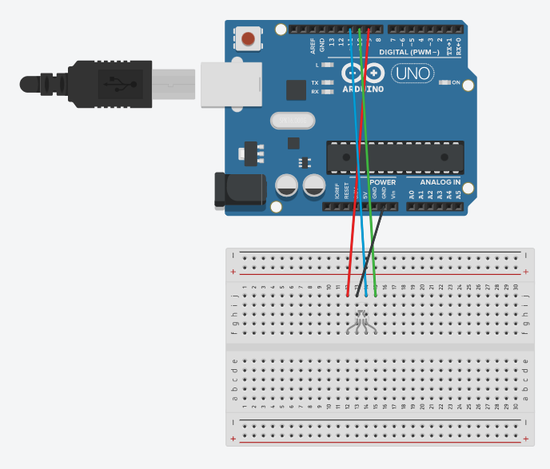

# RGB LED

## Components 
### RGB LED

* Is used as indicator, using a low electricity and lasts really long.
* The main difference with a common LED is that it has four pins instead of two and represents three different colors.

## Diagram

Here´s the following example of a SMD tricolor LED connected to three pins for each color and another one to ground.

## Example
Here are the following examples, it contains two examples of turning one and off the three different colors of the RGB code, one turning on/off and the other with fade effect.

#### Diagram

#### Demo

#### Code

* **pinMode(PIN, OUTPUT);** sets the pin with number *PIN* as an output signal to turn on the LED.
* **digitalWrite(PIN, VALUE);** writes a digital value (HIGH=1 or LOW=0) on the pin with number *PIN*. *HIGH* turns on the pin and *LOW* turns off.

You can find the code [here](./src).
