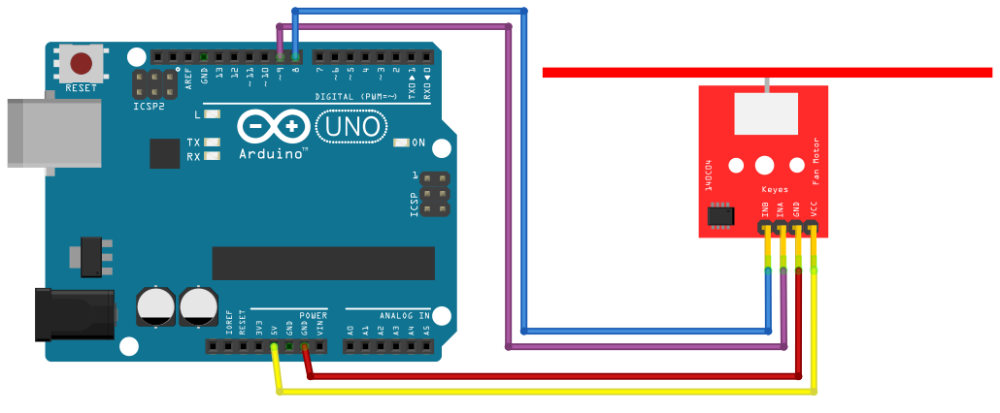

# Fan Motor

## Components 
### Fan Motor

* This system comes already assembled and soldered on a PCB offering 4 connection pins, two of them for the power supply (+VDC and GND), and the other two for the control of the 5V DC motor (INA and INB). 
* The INA pin is used to vary the speed of the DC motor by means of PWM pulses, so we must connect it to an Arduino digital pin that allows this type of pulsed digital output (digital pin 9 is used in the control program). 
* On the other hand, the INB pin is used to change the direction of rotation of the motor, i.e. when this pin is at LOW level the motor will rotate in one direction and when it is at HIGH level it will rotate in the opposite direction (digital pin 8 is used in the control program).

## Diagram

Here´s the following example of a Fan Motor.

## Example

Here´s the following example with a Fan Motor. It uses some code written by [Mariano Del Campo García](https://miarduinounotieneunblog.blogspot.com/2016/04/control-de-una-helice-con-motor-dc-y.html?m=1) which makes a menu to control the motor.

#### Demo

#### Code

You can find the code from [here](./Fan_Motor.ino).
