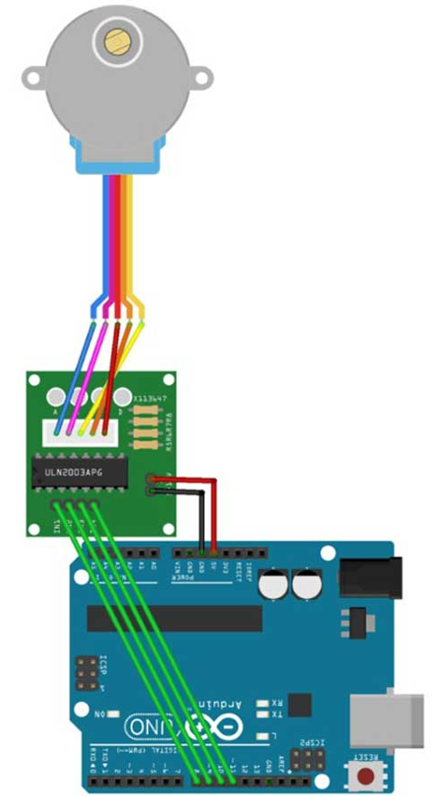

# Stepper

## Components 
### Stepper

* A stepper motor, like the 28BYJ-48 is a small, low-priced single-pole stepper motor. The electrical characteristics of the 28BYJ-48 are modest, but it incorporates an integrated gearbox which makes it a much more useful and interesting component.
* The 28BYJ-48 has a step of 5,625 degrees (64 steps per turn). The internal gearbox has a ratio of 1/64. Combined, the total accuracy is 4096 steps per turn, equivalent to a step of 0.088º, which is a very high accuracy.
* For the control of the 28BYJ-48 we are going to use a board with the ULN2003 integrated. The ULN2003 is a group of 7 Darlington pairs of which we will use 4, one for each phase of the stepper motor.
* A Darlington pair is a device that allows us to supply a higher current than we could using the Arduino outputs directly.

## Diagram

Here´s the following example of a Stepper motor.

## Example

Here´s the following example with a Stepper motor. It moves the stepper motor in one direction with speed, steps per revolutions and number of steps.

#### Demo

#### Code

You can find the code [here](./Stepper.ino).
