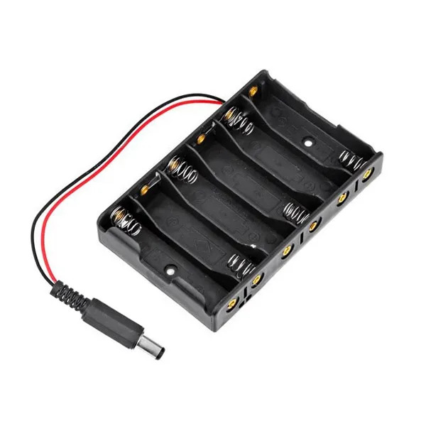

# 6AA Batteries Power Supply

## Components 
### 6AA Batteries Power Supply

* This 6AA battery box storage bracket with DC2.1 power connector for Arduino Holds 6 AA batteries which can make 7.2V rechargeable NiMH/NiCd battery or 9V alkaline battery Power supply for monolithic system, Arduino system, 2WD mobile robot, etc. With DC05 power supply plug.
* Voltage: 9V Material: Plastic Power: 6 x 1.5 V AA Batteries

