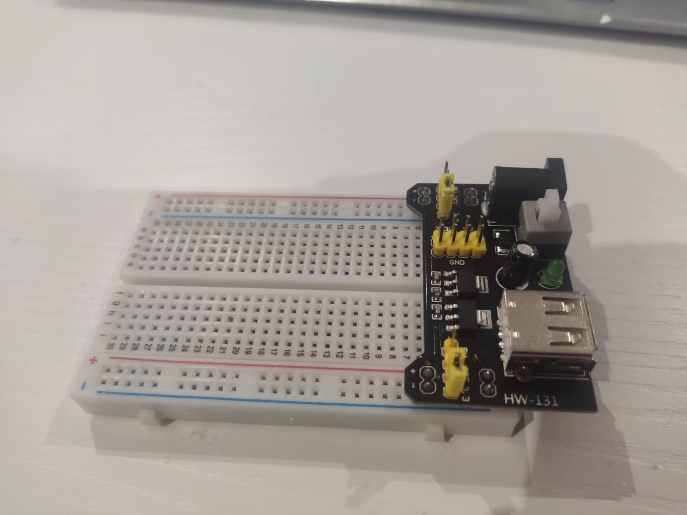

# Mini Power Supply (HW-131)

## Components 
### Mini Power Supply (HW-131)

* The Mini Power Supply module (HW-131) that allows to power a MB-102 breadboard via plug to a wall transformer up to 12v. It provides two independent outputs that are selectable by jumpers and can supply 5V or 3.3V. It also has a 5V output via USB connector.
* Handy power supply that simplifies powering breadboard and electronic circuits especially digital ones, ideal with any version of Arduino and PIC microcontrollers.
* Each side of the power supply has an on/off and voltage selection jumper.

