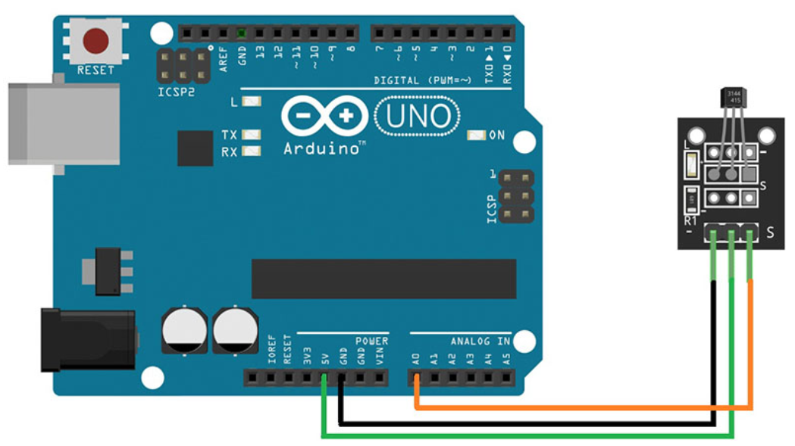

# Analog Hall

## Components 
### Analog Hall

* An analog hall is a type of sensor that turns measures a magnetic field nearby.
* There are two main types of halls which are KY-035 that only inputs an analog signal from 0 to 1023 and the KY-025 (Linear Hall) which has a potentiometer and detects a digital and analog signal.

## Diagram

Here´s the following example of an Analog Hall.

## Example

Here´s the following example with an Analog Hall. It just detects the magnetic field and prints on serial monitor, detecting if a magnetic field is here and turning on/off the builtin LED.

#### Demo

#### Code

You can find the code [here](./Analog_Hall.ino).
