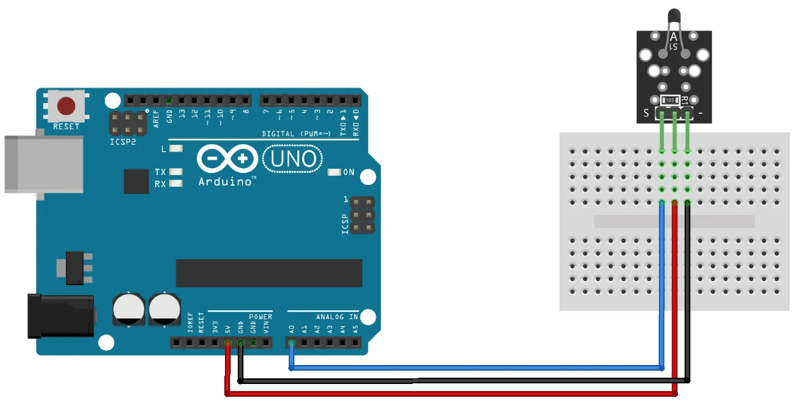

# Analog Temperature

## Components 
### Analog Temperature

* The KY-013 Analog Temperature Sensor module can measure ambient temperature based on the resistance of the thermistor on the board.
* This module consist of a NTC thermistor, a 10 kΩ resistor, and 3 male header pins. The thermistor resistance varies according to its surrounding temperature. The value of resistance can be used to calculate the actual temperature.

## Diagram

Here´s the following example of a Analog Temperature sensor.

## Example

Here´s the following example with an Analog Temperature sensor. It measures the ambient temperature and prints it on serial monitor.

#### Demo

#### Code

You can find the code [here](./Analog_Temperature.ino).
