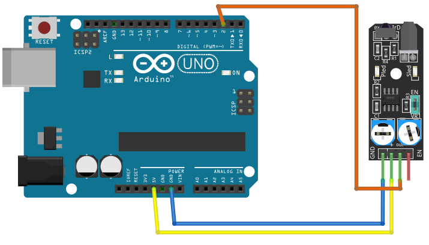

# Avoid

## Components 
### Avoid

* Infrared IR Sensor Obstacle Avoidance Sensor board is an inexpensive solution to avoidance detection for robotics, smart car, and other electronic uses.
* Infrared Obstacle Sensor Module has a built-in IR transmitter and IR receiver that sends out IR energy and looks for reflected IR energy to detect the presence of any obstacle in front of the sensor module. 
* The module has an onboard potentiometer that lets users adjust the detection range. The sensor has a very good and stable response even in ambient light or in complete darkness.

## Diagram

Here´s the following example of a Avoidance Obstacle sensor.

## Example

Here´s the following example with a Avoidance Obstacle sensor. It just turns on/off the builtin LED and prints on the serial monitor

#### Demo

#### Code

You can find the code [here](./Avoid.ino).
