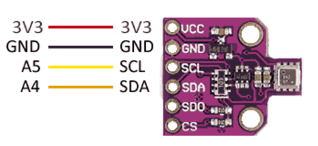

# BME680

## Components 
### BME680

* The BME680 is an indoor air quality sensor from Bosch that incorporates measurement of temperature, humidity, barometric pressure and volatile organic compound (VOC) content that can easily be used in conjunction with a processor such as an Arduino.
* The sensor can detect some gases such as carbon monoxide, ethanol, or acetone. It is also possible to calculate indoor air quality parameters, as well as estimate the amount of carbon dioxide equivalent.
* However, the BEM680 cannot distinguish between gases or measure each one individually. Instead, it totals the total VOC effect to provide a quantitative idea of the resulting air quality.

## Diagram

Here´s the following example of a BME680 sensor.

## Example

Here´s the following example with a BME680 sensor. It gets and prints the temperature, pressure, humidity, gas and approx. altitude.

#### Demo

#### Code

You can find the code from [here](./BME680.ino).
