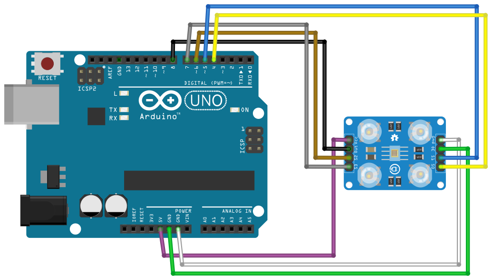

# Color

## Components 
### Color

* Color sensors provide more reliable solutions to complex automation challenges. They are used in various industries including the food and beverage, automotive and manufacturing industries for purposes such as detecting material, detecting color marks on parts, verifying steps in the manufacturing process and so on.

* While expensive color sensors are used in industrial applications, inexpensive sensors such as TCS230 color sensor can be used for less stringent applications.

* The TCS230 color sensor (also branded as the TCS3200) is quite popular, inexpensive and easy to use. Before we use this color sensor in our Arduino project, it would be good to see how a color sensor actually works.

## Diagram

Here´s the following example of a Color sensor.

## Example

Here´s the following example with a Color sensor. It just shows on the serial monitor the RGB values and prints the color detected.

#### Demo

#### Code

You can find the code for calibration [here](./Calibration) and the code for color detection [here](./Color.ino).
