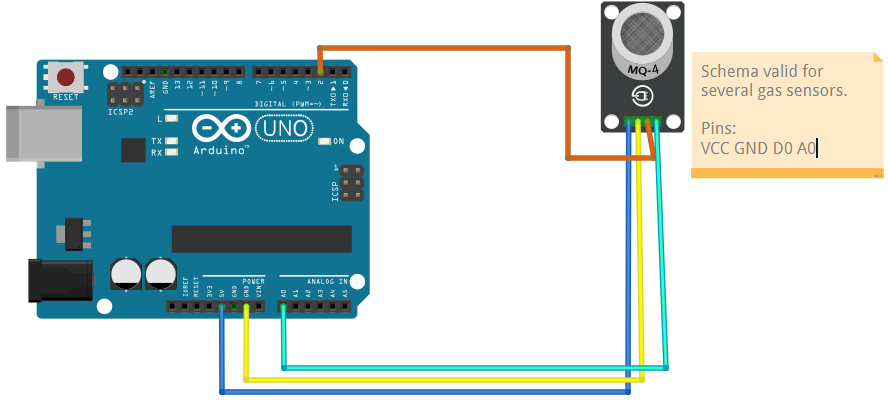

# Gas and Smoke

## Components 
### Gas Smoke

* MQ-2 is a Combustible Gas and Smoke Sensor. This sensor can also detect LPG, Alcohol, Propane, Hydrogen, Methane, and Carbon Monoxide.
* The MQ-2 gas sensor needs a heating element in order to properly detect combustible glasses but, a heating element close to combustible gasses could be disastrous, so the sensor is manufactured with an anti-explosion network made out of two thin layers of stainless steel mesh as you can see in the image below. The heating element is placed inside this stainless steel mesh

## Diagram

Here´s the following example of a Gas and Smoke sensor.

## Example

Here´s the following example with a Gas and Smoke sensor. It measures the ambient gas and smoke and prints the analog value.

#### Demo

#### Code

You can find the code [here](./Gas_and_Smoke.ino).
