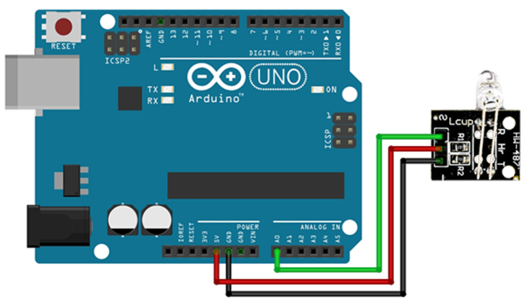

# Heartbeat

## Components 
### Heartbeat

* The KY-039 heartbeat sensor module can be used to detect the heartbeat signal using finger. This sensor has an analog output. 
* By placing your finger on the module, you can see the heartbeat signal through the analog output pin.

## Diagram

Here´s the following example of a Heartbeat sensor.

## Example

Here´s the following example with a Heartbeat sensor. It measures the heartbeats per minute and prints them on serial monitor.

#### Demo

#### Code

You can find the code [here](./Heartbeat.ino).
