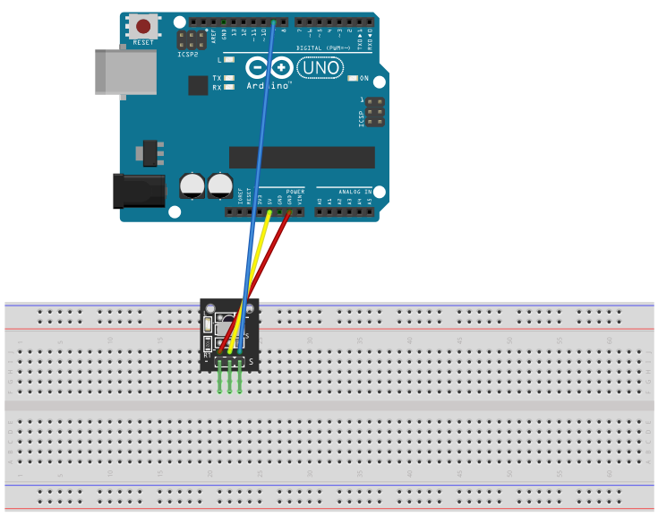

# IR Receiver

## Components 
### IR Receiver

* IR Receiver uses a 1838 IR Receiver that gets an Hexadecimal input from a IR signal.
* There are models like KY-022 that integrates a resistance and a LED together with the basic 1838 IR Receiver.

## Diagram

Here´s the following example of a IR receiver that just outputs the signal received in the serial monitor.

## Example

Here´s the following example with a IR Receiver. The code just prints the signal received in the serial monitor. It can be used to control received signals and interpret them.

#### Demo

#### Code

* **#include <IRremote.h>** from [IRremote](https://github.com/Arduino-IRremote/Arduino-IRremote).
* **IRrecv irrecv(RECV_PIN);** sets the PIN where to read from the IR signal.
* **decode_results results;** variable to store the obtained HEX values.
* **irrecv.enableIRIn();** enables the value reception on the receiver.
* **irrecv.decode(&results)** receives, decodes and stores results in *results*.

You can find the code [here](./IR_Receiver.ino).
