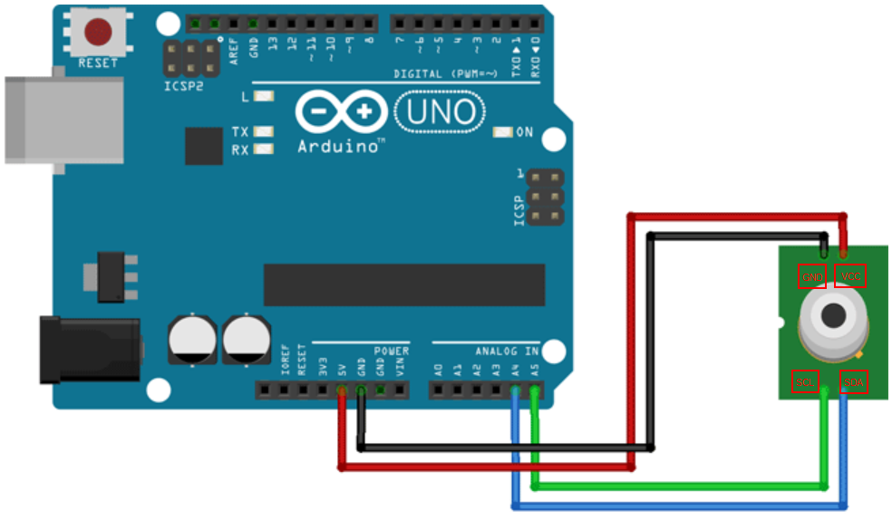

# Infrarred Temperature

## Components 
### Infrarred Temperature

* The MLX90614 is a non-contact infrared temperature sensor manufactured by Melexis. It is possible to connect these sensors with an automaton or processor such as an Arduino to measure the temperature of an object remotely.
* There are different models of the MLX90614 each with a three-letter suffix. The different sensors differ in the operating voltage, the number of infrared sensors, and the position of the filter.
* Communication is via SMBus, a subset of the I2C bus, so it is easy to read, and it is possible to connect more than one sensor simultaneously.
* MLX90614 thermometers are often found embedded in modules such as the GY-906 that incorporate the electronics needed to connect it easily to an Arduino. In most modules, this includes a voltage regulator that allows direct powering at 5V.

## Diagram

Here´s the following example of a Infrarred Temperature sensor.

## Example

Here´s the following example with a Infrarred Temperature sensor. It reads the temperature from ambient and from object and prints them.

#### Demo

#### Code

You can find the code from [here](./Infrarred_Temperature.ino).
