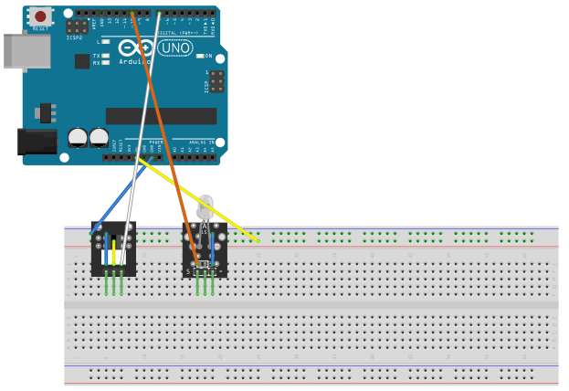

# Light Blocking

## Components 
### Light Blocking

* This photo-switch module for Arduino (compatible with other microcontrollers), will trigger a signal when light is blocked between the sensor gap.
* It consists of an optical emitter/detector on the front and two resistors (1kΩ and 33Ω) on the back.
* The sensor uses a beam of light between the emitter and detector to check if the path between the two is blocked by an opaque object. Useful in applications such as limit switches among others.

## Diagram

Here´s the following example of a Light Blocking sensor.

## Example

Here´s the following example with a Light Blocking sensor. It just turns a LED on when light is cut.

#### Demo

#### Code

You can find the code [here](./Light_Blocking.ino).
