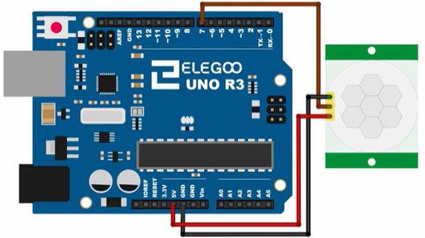
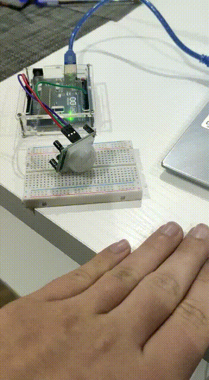

# PIR

## Components 
### PIR

* PIR sensors are based on the measurement of infrared radiation. All bodies (living and non-living) emit a certain amount of infrared energy, the higher the temperature, the more infrared energy they emit. PIR devices have a pyroelectric sensor capable of capturing this radiation and converting it into an electrical signal.
* Each sensor is divided into two fields and there is an electrical circuit that compensates for both measurements. If both fields receive the same amount of infrared, the resulting electrical signal is zero. On the other hand, if the two fields measure differently, an electrical signal is generated.
* Thus, if an object passes through one of the fields, a differential electrical signal is generated, which is picked up by the sensor, and a digital signal is emitted.

## Diagram

Here´s the following example of a PIR sensor.

## Example

Here´s the following example with a PIR sensor. It sets the PIR pin, waits until it is ready and then just turns on the builtin LED when motion is detected.

#### Demo

#### Code

You can find the code [here](./PIR.ino).
